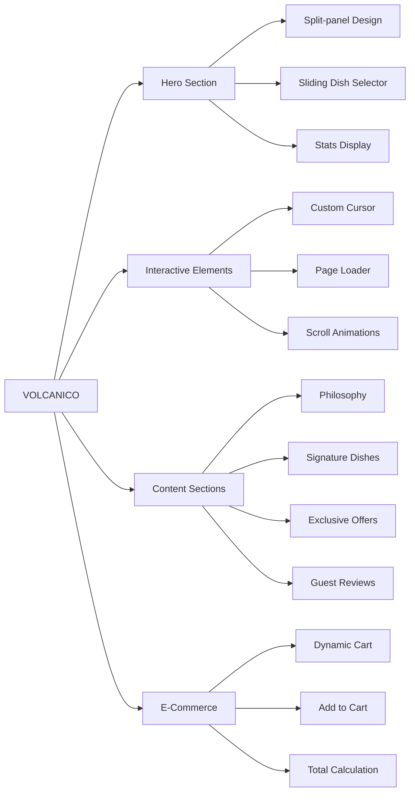

# 🌋 Volcanico - Fire Kitchen

<div align="center">
  
  

  ### 🔥 WHERE FIRE MEETS ART - Mumbai's Most Audacious Fire-Kitchen

  [](https://volcanico.vercel.app)
  [](https://github.com/bharat-poojari/VOLCANICO/stargazers)
  [](https://github.com/bharat-poojari/VOLCANICO/network)
  [](https://opensource.org/licenses/MIT)
  [](https://volcanico.vercel.app)
  [](https://volcanico.vercel.app)
  
  <p align="center">
    <a href="#-overview"><strong>Overview</strong></a> •
    <a href="#-live-demo"><strong>Live Demo</strong></a> •
    <a href="#-features"><strong>Features</strong></a> •
    <a href="#-installation"><strong>Installation</strong></a> •
    <a href="#-technology-stack"><strong>Tech Stack</strong></a> •
    <a href="#-project-structure"><strong>Structure</strong></a> •
    <a href="#-contributing"><strong>Contributing</strong></a>
  </p>
</div>


## 📸 Screenshots
<div style="white-space: nowrap; overflow-x: auto; padding: 10px 0;">
  
  
  
  
  
</div>
---

## 📋 Table of Contents

- [🌋 Overview](#-overview)
- [🎯 Live Demo](#-live-demo)
- [✨ Features](#-features)
- [📸 Screenshots](#-screenshots)
- [🚀 Installation](#-installation)
- [📁 Project Structure](#-project-structure)
- [🛠️ Technology Stack](#️-technology-stack)
- [🎨 Design Philosophy](#-design-philosophy)
- [📱 Responsive Design](#-responsive-design)
- [🗺️ Roadmap](#️-roadmap)
- [🤝 Contributing](#-contributing)
- [📄 License](#-license)
- [👤 Author & Contact](#-author--contact)
- [🙏 Acknowledgments](#-acknowledgments)

---

## 🌋 Overview

**Volcanico** is Mumbai's most audacious fire-kitchen concept brought to life as an immersive web experience. Established in 2018, the restaurant believes that "every dish is an act of controlled destruction — char, sear, smoke, and serve." This website captures that primal energy and refined technique through a dark-themed, interactive digital presence.

### 🎯 **Brand Identity**

| Element | Description |
|---------|-------------|
| **Tagline** | WHERE FIRE MEETS ART |
| **Established** | 2018 — Mumbai — Fire Kitchen |
| **Philosophy** | Controlled Chaos - Extraordinary flavors emerge from the edge of destruction |
| **Cooking Style** | Wood-Fired ✦ Farm-to-Flame ✦ Award-Winning ✦ Seasonal |
| **Rating** | 4.9★ with 12+ Awards and 50k+ Served |

### 💡 **Why This Website Stands Out**

| Feature | Standard Restaurant Sites | **Volcanico** |
|---------|--------------------------|---------------|
| **Visual Identity** | Basic imagery | ✅ **Immersive dark theme with fire aesthetics** |
| **User Interaction** | Static pages | ✅ **Custom cursor, page loader, scroll animations** |
| **Shopping Experience** | External platforms | ✅ **Dynamic in-page cart system** |
| **Storytelling** | Simple about page | ✅ **Immersive narrative with visual journey** |
| **Mobile Experience** | Clunky navigation | ✅ **Dedicated mobile menu with smooth interactions** |

---

## 🎯 Live Demo

<div align="center">

### 🌐 **Experience the Fire Kitchen Online!**

[](https://volcanico.vercel.app)

**🔗 URL:** [https://volcanico.vercel.app](https://volcanico.vercel.app)

*Deployed on Vercel • Immersive Experience • Mobile Responsive*

</div>

---

## ✨ Features

### 🔥 **Core Experience Features**



### 🎨 **Immersive UI/UX Features**

| Feature | Description | Visual Impact |
|---------|-------------|---------------|
| **Custom Cursor** | Fire-themed custom cursor replacement | Enhanced brand immersion |
| **Page Loader** | Animated loading sequence | Professional first impression |
| **Scroll Animations** | Reveal animations triggered on scroll | Engaging content discovery |
| **Dark Theme** | Premium dark color scheme by default | Sophisticated fire-kitchen aesthetic |
| **Split-Panel Hero** | Engaging dual-panel hero section | Dynamic visual storytelling |
| **Sliding Dish Selector** | Interactive dish showcase in hero | Engaging product discovery |

### 🍽️ **Content Sections**

| Section | Content | Interactive Elements |
|---------|---------|---------------------|
| **Hero** | "WHERE FIRE MEETS ART" with stats (12+ Awards, 4.9 Rating, 50k+ Served) | Sliding selector (01, 02, 03) |
| **Philosophy** | "The Philosophy of Controlled Chaos" - Cooking at 900°C | "Read our manifesto" link |
| **Signature Dishes** | Volcanic Lamb Rack, Magma Mushroom Risotto, Scorched Sea Bass, Lava Lava Cake | Status badges (Most Loved, Seasonal, Dessert) |
| **Exclusive Offers** | Weekend Brunch (20% OFF), Date Night Set (Free Dessert), First Order (₹200 OFF) | CTA buttons (Reserve, View Menu, Order) |
| **Story Immersive** | "A Kitchen Built on Controlled Fire" - Chef training across Tokyo, Paris, New York | "Read the Story" link |
| **Guest Reviews** | 4 reviews with 5★ ratings from Priya Mehta, Arjun & Sneha, Rahul Desai, Nandita K. | Profile initials, role badges |
| **Reservation CTA** | "Ready to Feel the Flame?" | Book table / Order online |

### 🛒 **Dynamic Cart System**

```javascript
// Cart Functionality Overview
const cartFeatures = {
    sidebar: "Interactive sidebar cart system",
    addItems: "Add menu items to cart",
    updateQuantity: "Increase/decrease item quantities",
    removeItems: "Remove items from cart",
    calculateTotal: "Automatic subtotal and total calculation",
    persistData: "Cart data persistence across pages"
};
```

---

## 📸 Screenshots

<div align="center">

### 🎨 **Website Interface Preview**

<table>
  <tr>
    <td><strong>🔥 Hero Section</strong></td>
    <td><strong>🍖 Signature Dishes</strong></td>
  </tr>
  <tr>
    <td></td>
    <td></td>
  </tr>
  <tr>
    <td><strong>📜 Philosophy Section</strong></td>
    <td><strong>⭐ Guest Reviews</strong></td>
  </tr>
  <tr>
    <td></td>
    <td></td>
  </tr>
</table>

### 🛒 **Cart & Offers Preview**

| Cart Sidebar | Exclusive Offers |
|--------------|------------------|
| Dynamic cart with item management | Weekend Brunch, Date Night, First Order |

</div>

> **📸 Note:** Actual screenshots coming soon! Visit the [Live Demo](https://volcanico.vercel.app) to experience the immersive design.

---

## 🚀 Installation

### 📋 **Prerequisites**

| Component | Requirement | Purpose |
|-----------|-------------|---------|
| **Web Browser** | Modern browser (Chrome/Firefox/Safari/Edge) | Viewing the website |
| **Git** | Optional | Version control |
| **Local Server** | Optional (VS Code Live Server) | Enhanced local development |

### ⚡ **Step-by-Step Installation**

<details>
<summary><b>1️⃣ Clone Repository</b></summary>

```bash
# Clone the repository
git clone https://github.com/bharat-poojari/VOLCANICO.git

# Navigate to project directory
cd VOLCANICO
```
</details>

<details>
<summary><b>2️⃣ Direct Open (No Build Required)</b></summary>

```bash
# Simply open index.html in your browser
open index.html  # Mac
start index.html # Windows
xdg-open index.html # Linux
```
</details>

<details>
<summary><b>3️⃣ Using Live Server (Recommended)</b></summary>

```bash
# If using VS Code, install "Live Server" extension
# Right-click index.html → "Open with Live Server"

# Or use any static server
npx serve
# Visit http://localhost:3000
```
</details>

---

## 📁 Project Structure

```
VOLCANICO/
│
├── 📄 index.html              # Homepage with hero, philosophy, dishes, offers, reviews
├── ⚡ main.js                 # Main JavaScript - UI components & cart logic
├── 🎨 style.css               # Global styles, animations, responsive styles
│
├── 📂 pages/                  # Additional pages
│   ├── 📄 about.html          # About Us - Volcanico story
│   ├── 📄 contact.html        # Contact & table reservation page
│   └── 📄 shop.html           # Menu and ordering page
│
├── 📂 assets/                 # Static assets (optional)
│   ├── 📂 images/
│   │   ├── 🖼️ logo.png
│   │   ├── 🖼️ hero-bg.jpg
│   │   ├── 🖼️ dishes/
│   │   └── 🖼️ reviews/
│   └── 📂 fonts/
│
├── 📄 README.md               # Project documentation
├── 📄 LICENSE                 # MIT License
└── 📄 .gitignore             # Git ignore rules
```

### 📊 **File Descriptions**

| File | Purpose | Key Contents |
|------|---------|--------------|
| `index.html` | Main landing page | Hero slider, philosophy, signature dishes, offers, reviews |
| `main.js` | Core functionality | Cart system, UI interactions, scroll animations, mobile menu |
| `style.css` | Complete styling | CSS variables, dark theme, responsive breakpoints, animations |
| `pages/about.html` | About page | Restaurant story, chef profiles, timeline |
| `pages/contact.html` | Contact page | Reservation form, location map, contact details |
| `pages/shop.html` | Menu page | Full menu with categories, add to cart functionality |

---

## 🛠️ Technology Stack

### 📊 **Complete Tech Stack Overview**

| Category | Technology | Purpose |
|----------|------------|---------|
| **Structure** | HTML5 | Semantic markup |
| **Styling** | CSS3 | Custom properties, Flexbox/Grid, animations |
| **Logic** | Vanilla JavaScript (ES6+) | DOM manipulation, cart, events |
| **Typography** | Google Fonts | Cormorant Garamond, DM Sans, Bebas Neue |
| **Deployment** | Vercel | Hosting & automatic deployments |
| **Version Control** | Git & GitHub | Source code management |

### 🎨 **CSS Architecture**

```css
/* Core CSS Variables (Dark Theme) */
:root {
    /* Fire Kitchen Color Palette */
    --primary: #ff4500;        /* Volcanic orange-red */
    --primary-dark: #cc3700;   /* Deep ember */
    --secondary: #1a1a1a;      /* Dark charcoal */
    --accent: #ffd700;         /* Flame gold */
    
    /* Background & Text */
    --bg-primary: #0a0a0a;
    --bg-secondary: #111111;
    --text-primary: #ffffff;
    --text-secondary: #a0a0a0;
    
    /* Typography */
    --font-heading: 'Cormorant Garamond', serif;
    --font-body: 'DM Sans', sans-serif;
    --font-accent: 'Bebas Neue', sans-serif;
}
```

### 📦 **Google Fonts Used**

| Font | Usage | Style |
|------|-------|-------|
| **Cormorant Garamond** | Headings, philosophy text | Elegant, sophisticated serif |
| **DM Sans** | Body text, descriptions | Clean, readable sans-serif |
| **Bebas Neue** | Accents, buttons, tags | Bold, impactful display font |

---

## 🎨 Design Philosophy

### 🔥 **Visual Identity System**

| Element | Implementation | Brand Impact |
|---------|----------------|--------------|
| **Color Palette** | Volcanic orange, deep charcoal, flame gold | Evokes fire, heat, sophistication |
| **Typography** | Serif headings + Sans-serif body | Balance of elegance and readability |
| **Imagery** | Dark, moody food photography | Premium fire-kitchen aesthetic |
| **Animations** | Scroll reveals, fade transitions | Engaging, theatrical experience |
| **Custom Cursor** | Fire-themed replacement | Immersive brand touchpoint |

### 📱 **Mobile Experience**

```css
/* Mobile-First Responsive Design */
.mobile-menu {
    /* Dedicated hamburger menu for mobile */
    transform: translateX(-100%);
    transition: transform 0.3s ease;
}

.mobile-menu.active {
    transform: translateX(0);
}

/* Responsive cart sidebar */
.cart-sidebar {
    width: 100%;
    max-width: 400px;
}
```

---

## 📱 Responsive Design

### 📊 **Breakpoint System**

| Breakpoint | Screen Width | Layout Adjustments |
|------------|--------------|-------------------|
| **Mobile** | < 640px | Stacked layout, hamburger menu, full-width cart |
| **Tablet** | 640px - 1024px | Two-column grid, condensed navigation |
| **Desktop** | > 1024px | Full multi-column layout, expanded navigation |
| **Wide** | > 1440px | Maximum width container, enhanced spacing |

### 📱 **Mobile-Specific Features**

| Feature | Desktop | Mobile |
|---------|---------|--------|
| **Navigation** | Horizontal menu | Hamburger slide-out menu |
| **Cart** | Sidebar overlay | Full-screen drawer |
| **Hero Slider** | Touch/swipe enabled | Touch optimized |
| **Images** | High resolution | Optimized for mobile data |

---

## 🗺️ Roadmap

### **Phase 1: Core Website (Complete) ✅**
- [x] Immersive homepage with hero slider
- [x] Philosophy and story sections
- [x] Signature dishes showcase
- [x] Exclusive offers display
- [x] Guest reviews carousel
- [x] Dynamic cart system
- [x] Custom cursor and page loader
- [x] Scroll-triggered animations
- [x] Mobile responsive design
- [x] About, Contact, and Shop pages

### **Phase 2: Enhanced Features (In Progress) 🏗️**
- [ ] Online reservation system with time slots
- [ ] Integration with restaurant booking API
- [ ] Email notifications for reservations
- [ ] Menu filtering by dietary preferences
- [ ] Image gallery with lightbox
- [ ] Blog section for fire-kitchen stories
- [ ] Newsletter subscription

### **Phase 3: E-Commerce Expansion (Planned) 🚀**
- [ ] Full online ordering system
- [ ] Payment gateway integration
- [ ] User accounts and order history
- [ ] Loyalty program system
- [ ] Delivery tracking
- [ ] Push notifications for order updates

### **Phase 4: Advanced Features (Future) 🔮**
- [ ] PWA (Progressive Web App) support
- [ ] Multi-language support
- [ ] Virtual tour of the fire-kitchen
- [ ] AI-powered menu recommendations
- [ ] Social media integration
- [ ] Analytics dashboard

---

## 🤝 Contributing

### 🌟 **We Welcome Contributions!**

| Contribution Type | Description | Good For |
|-------------------|-------------|----------|
| **🐛 Bug Reports** | Report issues and bugs | Everyone |
| **💡 Feature Requests** | Suggest new features | Users & Developers |
| **📝 Documentation** | Improve README, add comments | Technical Writers |
| **💻 Code** | Fix bugs, add features | Frontend Developers |
| **🎨 Design** | Improve UI/UX | Designers |

### 📋 **Contribution Workflow**

```bash
# 1. Fork the repository
# Click 'Fork' button on GitHub

# 2. Clone your fork
git clone https://github.com/your-username/VOLCANICO.git
cd VOLCANICO

# 3. Create feature branch
git checkout -b feature/amazing-feature

# 4. Make changes and test locally
# Open index.html in browser to test

# 5. Commit changes
git add .
git commit -m '✨ Add amazing feature'

# 6. Push to your fork
git push origin feature/amazing-feature

# 7. Open Pull Request
```

### ✅ **Code Standards**

```javascript
// Use ES6+ syntax
const initializeCart = () => {
    // Cart initialization logic
};

// Event listeners with named functions
const handleAddToCart = (event) => {
    const itemId = event.target.dataset.id;
    addItemToCart(itemId);
};

// Clear comments for complex logic
/**
 * Calculates cart total including any applicable discounts
 * @param {Array} cartItems - Array of cart items
 * @returns {number} Total price
 */
const calculateCartTotal = (cartItems) => {
    return cartItems.reduce((total, item) => total + (item.price * item.quantity), 0);
};
```

---

## 📄 License

Distributed under the **MIT License**. See `LICENSE` file for more information.

```
MIT License

Copyright (c) 2026 Bharat Poojari

Permission is hereby granted, free of charge, to any person obtaining a copy
of this software and associated documentation files (the "Software"), to deal
in the Software without restriction, including without limitation the rights
to use, copy, modify, merge, publish, distribute, sublicense, and/or sell
copies of the Software, and to permit persons to whom the Software is
furnished to do so, subject to the following conditions:

The above copyright notice and this permission notice shall be included in all
copies or substantial portions of the Software.

THE SOFTWARE IS PROVIDED "AS IS", WITHOUT WARRANTY OF ANY KIND, EXPRESS OR
IMPLIED, INCLUDING BUT NOT LIMITED TO THE WARRANTIES OF MERCHANTABILITY,
FITNESS FOR A PARTICULAR PURPOSE AND NONINFRINGEMENT. IN NO EVENT SHALL THE
AUTHORS OR COPYRIGHT HOLDERS BE LIABLE FOR ANY CLAIM, DAMAGES OR OTHER
LIABILITY, WHETHER IN AN ACTION OF CONTRACT, TORT OR OTHERWISE, ARISING FROM,
OUT OF OR IN CONNECTION WITH THE SOFTWARE OR THE USE OR OTHER DEALINGS IN THE
SOFTWARE.
```

---

## 👤 Author & Contact

<div align="center">

### Bharat Poojari
**Full-Stack Developer & Creative Coder**

*Crafting immersive digital experiences for bold brands*

[](https://bharat-poojari.vercel.app)
[](https://github.com/bharat-poojari)
[](https://linkedin.com/in/bharat-poojari-397618359)
[](https://kaggle.com/bharatpoojari03)
[](mailto:bharatp0316@gmail.com)

</div>

### 📞 **Project Links**

| Resource | Link | Purpose |
|----------|------|---------|
| **GitHub Repository** | [VOLCANICO](https://github.com/bharat-poojari/VOLCANICO) | Source code |
| **Live Demo** | [View Website](https://volcanico.vercel.app) | Production deployment |
| **Issues** | [Report Issue](https://github.com/bharat-poojari/VOLCANICO/issues) | Bug reports |
| **Discussions** | [Q&A](https://github.com/bharat-poojari/VOLCANICO/discussions) | Community support |

### 📧 **Restaurant Contact (Demo)**

| Channel | Details |
|---------|---------|
| **Email** | hello@VOLCANICO.in |
| **Phone** | +91 98765 43210 |
| **Location** | 12 Flameway Lane, Bandra West, Mumbai 400050 |
| **Hours** | Open Daily 11–11 |

---

## 🙏 Acknowledgments

### 🛠️ **Technologies & Tools**

| Project | Purpose | License |
|---------|---------|---------|
| **[Google Fonts](https://fonts.google.com/)** | Typography | Open Font License |
| **[Vercel](https://vercel.com)** | Hosting & Deployment | Free tier |
| **[Font Awesome](https://fontawesome.com/)** | Icons (if used) | Free tier |

### 🎨 **Design Inspiration**

- **Fire Kitchen Concept** - Primal cooking meets refined technique
- **Dark Theme Aesthetics** - Premium, sophisticated visual identity
- **Immersive Storytelling** - Narrative-driven web experiences

### 👏 **Special Thanks**

- **Restaurant Industry** - For inspiration and standards
- **Open Source Community** - For tools and resources
- **You** - For exploring this project!

---

## ⭐ Support the Project

If you find this project impressive or helpful, please consider:

<div align="center">

[](https://github.com/bharat-poojari/VOLCANICO)
[](https://twitter.com/intent/tweet?text=Check%20out%20VOLCANICO%20-%20an%20immersive%20fire-kitchen%20website!%20https://github.com/bharat-poojari/VOLCANICO)
[](https://github.com/sponsors/bharat-poojari)

### 📊 Project Statistics


</div>

---

<div align="center">

### 🔥 WHERE FIRE MEETS ART

[](https://volcanico.vercel.app)


**© 2025 VOLCANICO Fire Kitchen. All rights reserved.**

*Est. 2018 — Mumbai — Fire Kitchen • Wood-Fired ✦ Farm-to-Flame ✦ Award-Winning* 🌋✨

</div>
